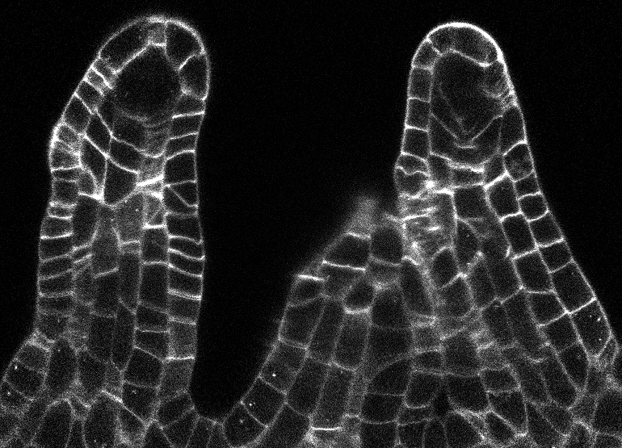
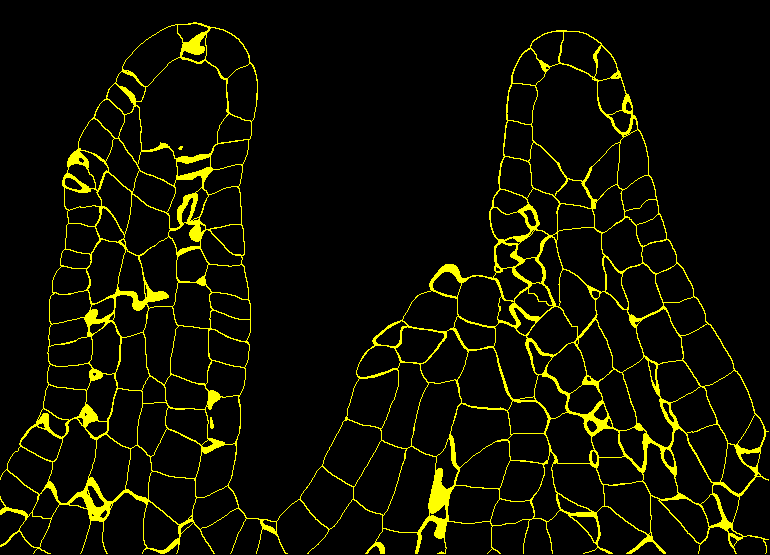
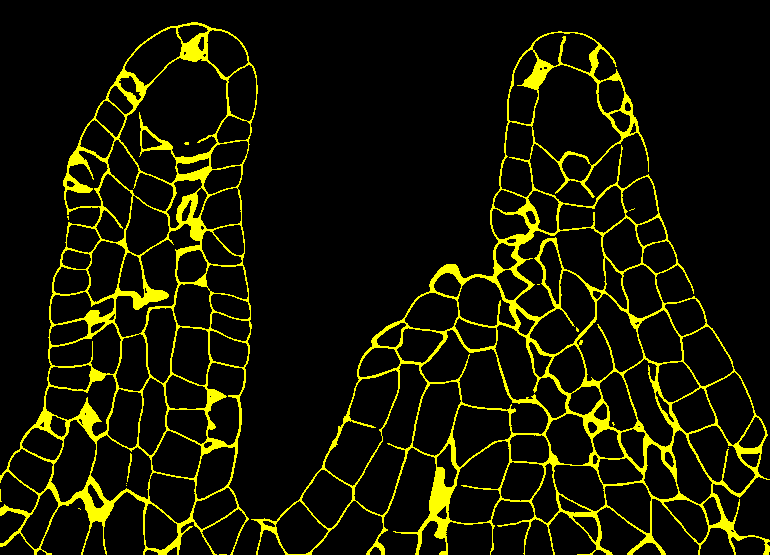

# Use-case 2: 3D U-Net for cell-segmentation in light microscopy

## Initial training in ZeroCost (option A) or BiaPy (option B)

### Option A) ZeroCost

TODO: describe training in zerocost (@esgomezm)


### Option B) BiaPy

To begin the initial training using [BiaPy](https://biapyx.github.io/), you will need to follow the steps outlined below. In this tutorial, we will run a **semantic segmentation workflow with BiaPy** through the command line. We chose this option because the dataset used in this tutorial is relatively large, and running on Colab may lead to **memory limitations** or **restricted training time**. Using the command line ensures more flexibility and avoids these issues.

---

## Prerequisites
- Install [BiaPy](https://biapy.readthedocs.io/en/latest/installation.html) on your system using either `conda` or `pip`. We strongly recommend installing the **latest stable version**, as all releases are backwards-compatible with previous ones. For a smoother experience and to avoid package conflicts with other projects, create a **dedicated environment** for BiaPy:  
  - [Conda environments](https://conda.io/projects/conda/en/latest/user-guide/tasks/manage-environments.html) (recommended for most users)  
  - [Python virtual environments (venv)](https://docs.python.org/3/library/venv.html) (lightweight alternative)  
 
- Download the dataset provided in this tutorial and unzip it.  
- Ensure your GPU drivers and CUDA environment (if using GPU) are correctly configured. You can verify it as follows:

  ```
  python -c 'import torch; print(torch.__version__)'
  >>> 2.4.0
  python -c 'import torch; print(torch.cuda.is_available())'
  >>> True 
  ```
---

## Step 1: Download the Configuration File
We provide a prepared YAML configuration file as a template. Download it from the following link:  

👉 [Download ovules.yaml](https://drive.google.com/file/d/1oyDCqtVHsTri9bgJ-LU8OyPRSLz4L4UF/view?usp=sharing)  

Save it to your working directory (e.g., `~/biapy_project/config.yaml`).  

---

## Step 2: Update the Configuration File
Open the `ovules.yaml` file in your favorite text editor and update the following fields:

### Dataset paths
Set the dataset paths to your local data folders:
- `DATA.TRAIN.PATH` → raw training images  
- `DATA.TRAIN.GT_PATH` → training ground-truth (boundaries)  
- `DATA.VAL.PATH` → validation images  
- `DATA.VAL.GT_PATH` → validation ground-truth  
- `DATA.TEST.PATH` → test images  
- `DATA.TEST.GT_PATH` → test ground-truth  

Example:
```yaml
DATA:
  TRAIN:
    PATH: "/home/user/datasets/ovules/train/raw"
    GT_PATH: "/home/user/datasets/ovules/train/boundaries"
  VAL:
    PATH: "/home/user/datasets/ovules/val/raw"
    GT_PATH: "/home/user/datasets/ovules/val/boundaries"
  TEST:
    PATH: "/home/user/datasets/ovules/test/raw"
    GT_PATH: "/home/user/datasets/ovules/test/boundaries"
```

### BMZ model export metadata
Fill in the metadata for exporting your trained model to the BioImage Model Zoo.
Edit the fields under ``MODEL.BMZ.EXPORT``, such as model name (``MODEL.BMZ.EXPORT.MODEL_NAME``), description (``MODEL.BMZ.EXPORT.DESCRIPTION``), authors (``MODEL.BMZ.EXPORT.AUTHORS``), citations (``MODEL.BMZ.EXPORT.CITE``) etc.

## Step 3: Run BiaPy Training

Once the configuration file is updated, you can launch training by running the following commands.  
Here we define a few variables for readability before calling BiaPy:

```bash
# Path to the configuration file you edited in Step 2
job_cfg_file=/home/user/ovules.yaml

# Directory where the experiment results will be saved
result_dir=/home/user/exp_results

# A descriptive name for the job (used to organize outputs)
job_name=ovules

# Counter number for reproducibility; 
# increase this if you want to rerun the same job multiple times
job_counter=1

# GPU ID to use (check with 'nvidia-smi'); set to -1 to run on CPU
gpu_number=0

# Activate your BiaPy environment
conda activate BiaPy_env

# Launch BiaPy training
biapy \
    --config $job_cfg_file \
    --result_dir $result_dir \
    --name $job_name \
    --run_id $job_counter \
    --gpu "$gpu_number"
```

## Step 4: Inspect Results

After training and inference, BiaPy will create output folders inside ``./results/``, including:

* **results/per_image/** → raw predicted segmentation masks

* **results/per_image_binarized/** → binarized boundary predictions (using Otsu)

👉 Example output of the test image ``N_590_final_crop_ds2_label.tif`` (slice 62):

<p align="center">
  <figure style="display:inline-block; text-align:center; margin:10px;">
    
    <figcaption>Raw input</figcaption>`
  </figure>
  <figure style="display:inline-block; text-align:center; margin:10px;">
    
    <figcaption>Ground truth boundaries</figcaption>
  </figure>
  <figure style="display:inline-block; text-align:center; margin:10px;">
    
    <figcaption>Model prediction (binarized)</figcaption>
  </figure>
</p>

## Step 5: Export the Model

If you configured the ``MODEL.BMZ.EXPORT`` section, the model will automatically be exported into BMZ format at the end of training. The exported `.zip` file will be saved in your results directory, under a path similar to: ``./results/ovules1_1/BMZ_files/``. This package is immediately ready for sharing or submission to the [BioImage Model Zoo](https://bioimage.io/).  

For reference, we have already exported and published the model from this tutorial: you can explore it on the BioImage Model Zoo under the name [**dazzling-blowfish**](https://bioimage.io/#/artifacts/dazzling-blowfish).  

---

## Application in ilastik

- Download the model with tensorflow weights for ilastik from: https://bioimage.io/#/?id=10.5281%2Fzenodo.5749843
- Download the Arabidopsis atlas data (different from the model training data!) from https://osf.io/fzr56/ (leaf)
- Crop the data and convert it to hdf5 with `to_h5.py` (could also use the ilastik data conversion workflow)
- ilastik neural network classification ([unet-prediction.ilp](TODO upload somewhere else, this is too large for GH))
    - Load the data
    - Load the model
    - Check the prediction
    - Export the prediction
- Create 4 smaller crops of the data and prediction for the multicut workflow with `cutouts_for_multicut.py`
- ilastik multicut workflow ([unet-segmentation.ilp](TODO upload somewhere else, this is too large for GH))
    - Load the data and predictions for block0
    - Train edge classifier on a few edges
    - Run segmentation for all 4 blocks (either using the prediction export applet or the `segment_multicut.py` script)

Integration with the multicut workflow enables cell segmentation based on the boundary predictions and allows to correct errors in the network prediction (that happen because of application to a different data modality) to be fixed by training an edge classifier.
See the screenshots below for prediction and multicut results in ilastik.


## Retraining in ZeroCost

- convert the raw data and segmentations for the 4 blocks to tif stacks with `convert_for_training.py`
- upload the resulting folder to your google drive so it can be loaded in the zero cost notebook for training and validation
- open the [3D U-Net zero cost notebook](https://colab.research.google.com/github/HenriquesLab/ZeroCostDL4Mic/blob/master/Colab_notebooks/U-Net_3D_ZeroCostDL4Mic.ipynb) in google colab
- load the [initial model](https://bioimage.io/#/?partner=zero&type=model&id=10.5281%2Fzenodo.5749843) and the training data from your google drive in the notebook and fine-tune the model for 15 iterations
- the fine-tuned model can be exported from the notebook, it's also available on bioimage.io: [humorous-owl](https://bioimage.io/#/?partner=zero&type=model&id=10.5281%2Fzenodo.6348728)

The fine-tuning significantly increses the model's performance for the leaf data, see a screenhot for a slice of the leaf raw data (left), predictions from the initial model (middle) and fine-tuned predictions (right) below. (On data not part of the training dataset.)


## Retraining in ZeroCost (option A) or BiaPy (option B)

### Option A) ZeroCost

TODO: describe retraining in zerocost (@esgomezm)

### Option B) BiaPy

TODO:

## Application in deepimageJ

- Predict on leaf data with DeepImageJ via `Run DeepImageJ`
- Use Morpholibj segmentation GUI for watershed based segmentation and label edit interface to correct labels
- Perform data measurements and plot them using the `plot.ijm` macro

See screenshots below for the steps:


### Dependencies

- ilastik: 1.4.0b21
- zeroCost 1.13
- Fiji 2.3.0
- DeepImageJ 2.1.15
